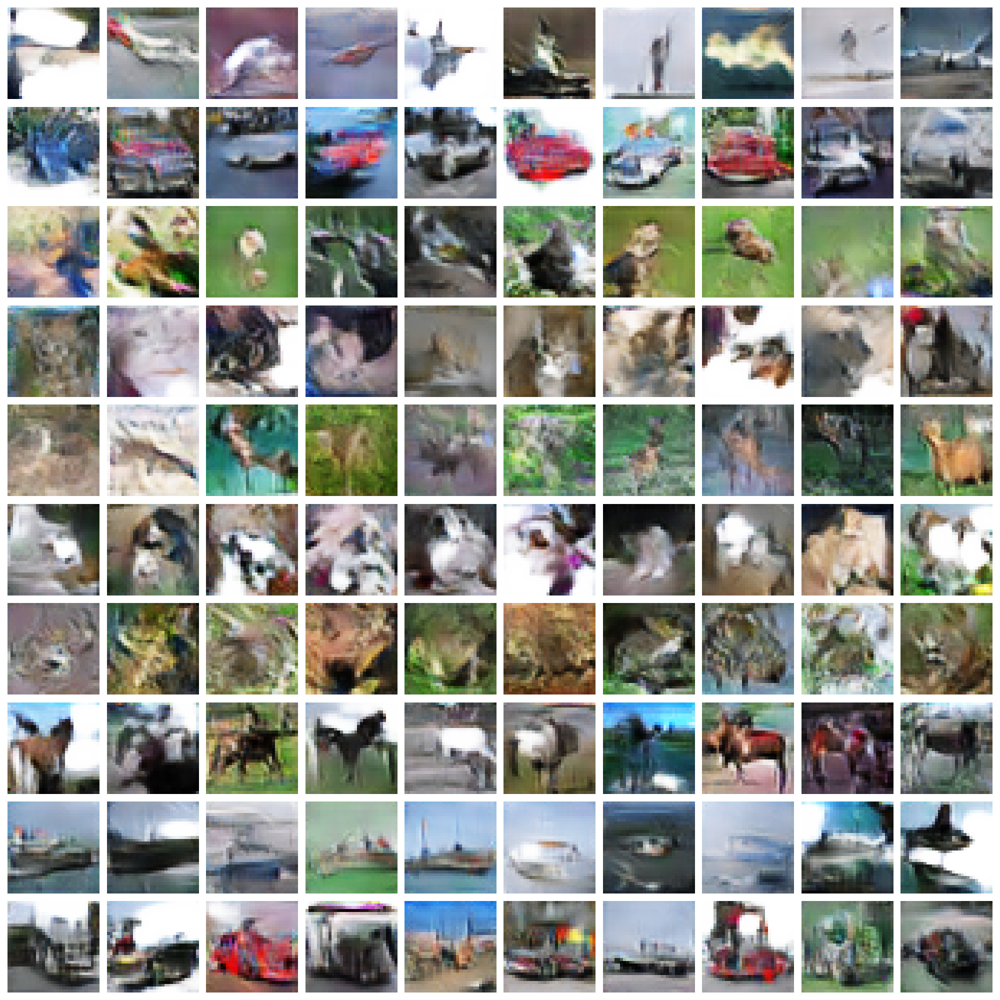

```shell script
python3 train.py --model acgangp --latent_dim 100 --label_dim 10 --batch_size 128 --epoch 201 --soft_gpu --lambda 10 --d_loop 1
```

```shell script
tensorborad --logdir visual/acgangp
```


