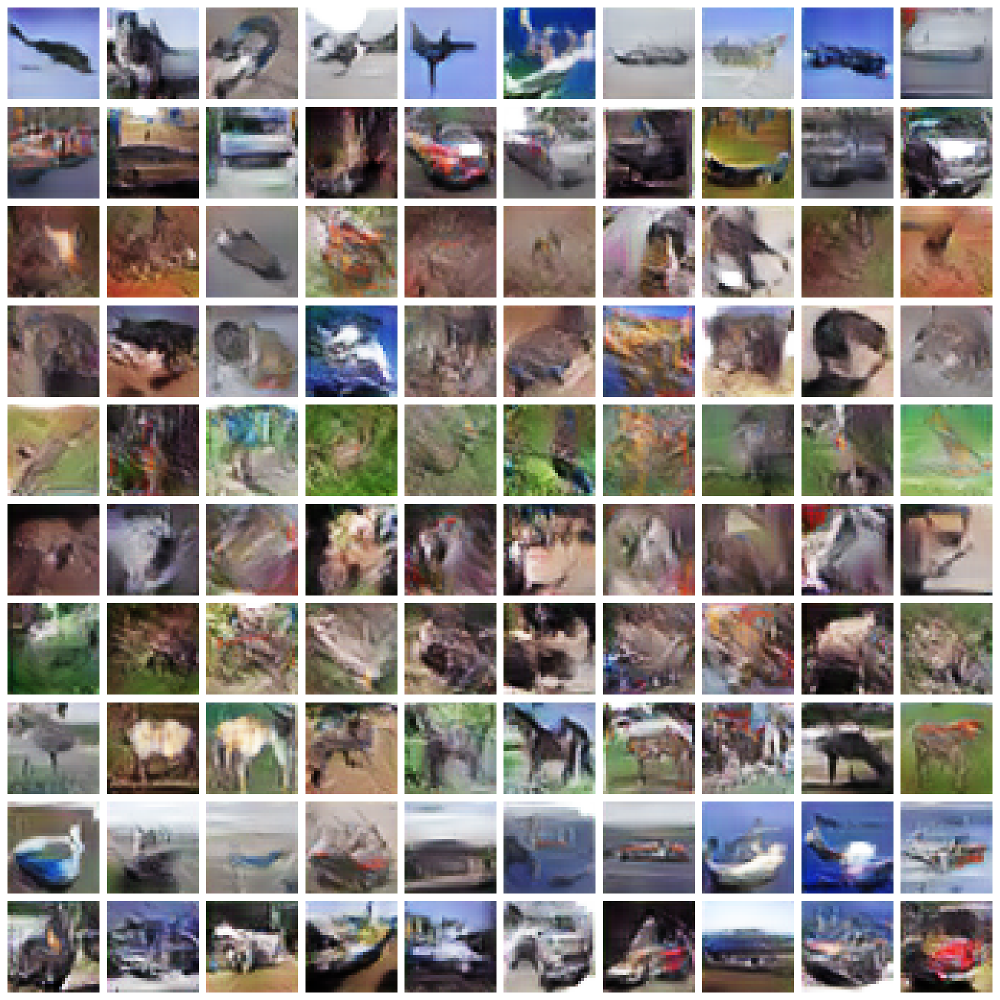

```shell script
# acgan without gradients penalty
python train.py --model acgan --latent_dim 256 --label_dim 10 --batch_size 64 --epoch 201 --soft_gpu -lr 0.0002 --beta1 0.5 --beta2 0.999 --net dcnet

# acgan with gradients penalty
python train.py --model acgangp --data_dir "D:\data\cifar-10" --latent_dim 256 --label_dim 10 --batch_size 64 --epoch 201 --soft_gpu --lambda 10 --d_loop 1 -lr 0.0002 --beta1 0 --beta2 0.9 --net dcnet
python train.py --model acgangp --data_dir "D:\data\cifar-10" --latent_dim 256 --label_dim 10 --batch_size 64 --epoch 201 --soft_gpu --lambda 10 --d_loop 1 -lr 0.0002 --beta1 0 --beta2 0.9 --net resnet
```

```shell script
tensorborad --logdir visual/acgan
tensorborad --logdir visual/acgangp
```

## acgan


## acgan with gp

